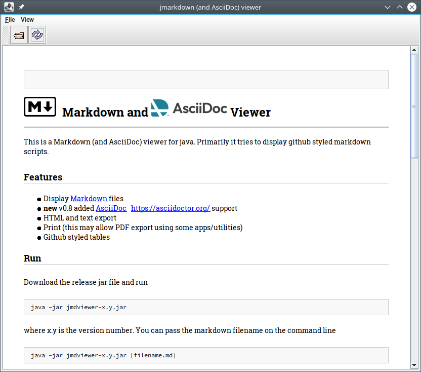

#  &nbsp; Markdown and  Viewer
---

This is a Markdown (and AsciiDoc) viewer for java. Primarily it tries to display github styled markdown scripts.



## Features

- Display [Markdown](https://www.markdownguide.org/) files
- **new** v0.8 added [AsciiDoc](https://asciidoc.org/) &nbsp; [https://asciidoctor.org/](https://asciidoctor.org/) support
- HTML and text export
- Print (this may allow PDF export using some apps/utilities)
- Github styled tables

## Run

Download the release jar file and run
```
java -jar jmdviewer-x.y.jar
```
where x.y is the version number. You can pass the markdown filename on the command line
```
java -jar jmdviewer-x.y.jar [filename.md]
```
## Build

In linux/osx/un*x:
```
mvnw clean package
```
in windows:
```
mvnw.cmd clean package
```
The built jar file is in the target folder.

## Pre-requisites

Java >= 1.8

## Notes / limitations

- Rendering of images and other html features is based on available features in Java
Swing. This generally support image formats such as jpg, png and gif. Unsupported image formats would be rendered with a broken image icon.

## Attributions
 
- Markdown parser: Commonmark java  
[https://github.com/commonmark/commonmark-java](https://github.com/commonmark/commonmark-java)
- AsciiDoc parser: AsciidoctorJ
[https://github.com/asciidoctor/asciidoctorj](https://github.com/asciidoctor/asciidoctorj)
[https://asciidoctor.org](https://asciidoctor.org)
- Apache Commons CLI
<https://commons.apache.org/proper/commons-cli/index.html>
- Last but not least Java and Java Swing itself. The html renderer isn't quite the most feature packed but is a mature implementation.

## License

This application is licensed under MIT license:
Copyright (c) 2021 Andrew Goh

Various sub-license for Commonmark-java and resources used is 
appended in LICENSE.txt

THE SOFTWARE IS PROVIDED "AS IS", WITHOUT WARRANTY OF ANY KIND, 
EXPRESS OR IMPLIED, INCLUDING BUT NOT LIMITED TO THE WARRANTIES OF
MERCHANTABILITY, FITNESS FOR A PARTICULAR PURPOSE AND NONINFRINGEMENT. 
IN NO EVENT SHALL THE AUTHORS OR COPYRIGHT HOLDERS BE LIABLE FOR ANY 
CLAIM, DAMAGES OR OTHER LIABILITY, WHETHER IN AN ACTION OF CONTRACT,
TORT OR OTHERWISE, ARISING FROM, OUT OF OR IN CONNECTION WITH THE SOFTWARE
OR THE USE OR OTHER DEALINGS IN THE SOFTWARE.

## Origin

github repository: 
[https://github.com/ag88/jmdviewer](https://github.com/ag88/jmdviewer)

Developing this has taken quite some effort mainly in getting it to work and rather extensive tests. if you use this app and found it useful, i'd really appreciate it if you could support my efforts [](https://donorbox.org/jmdviewer).
you could also help simply starring this repository ;)